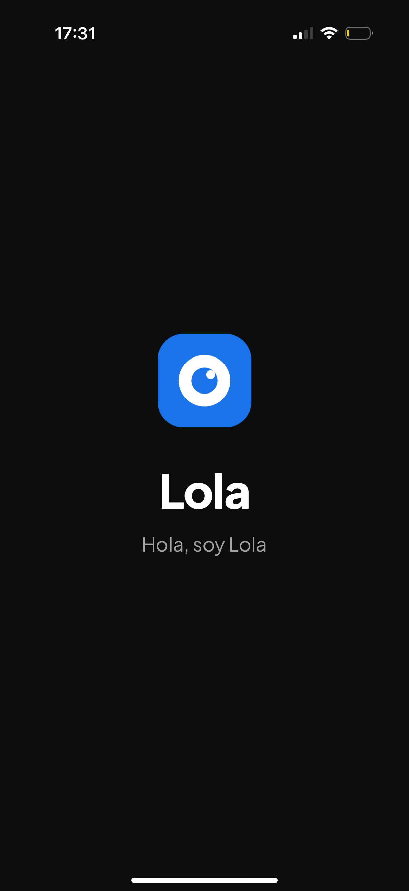
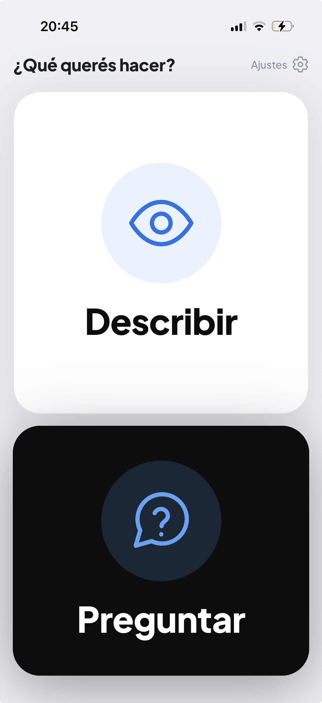
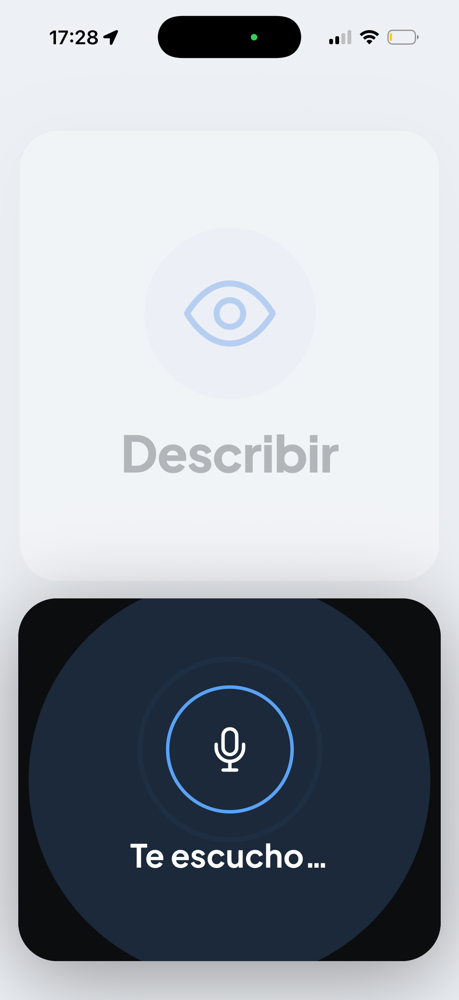
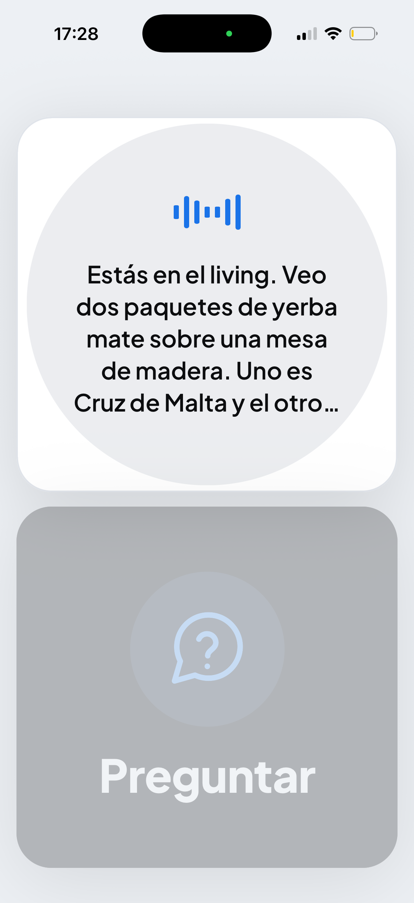
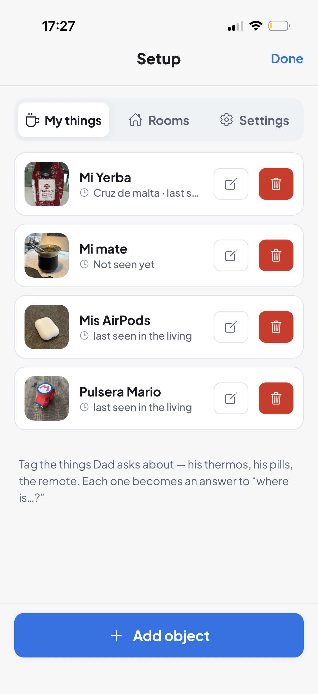
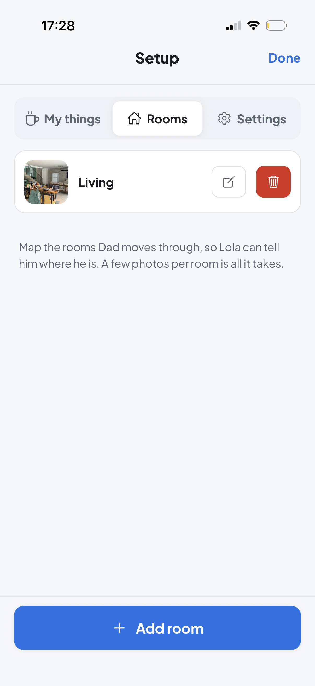
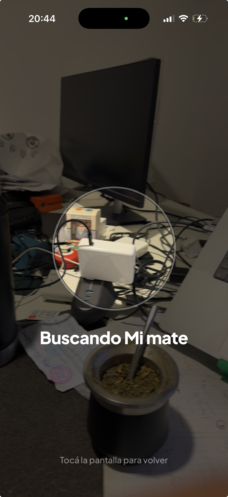
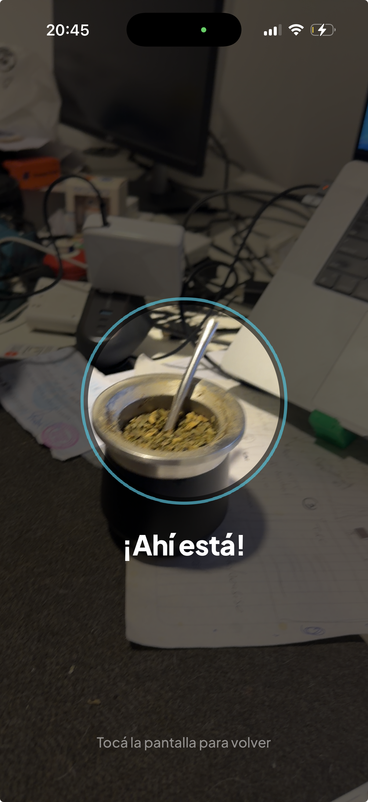
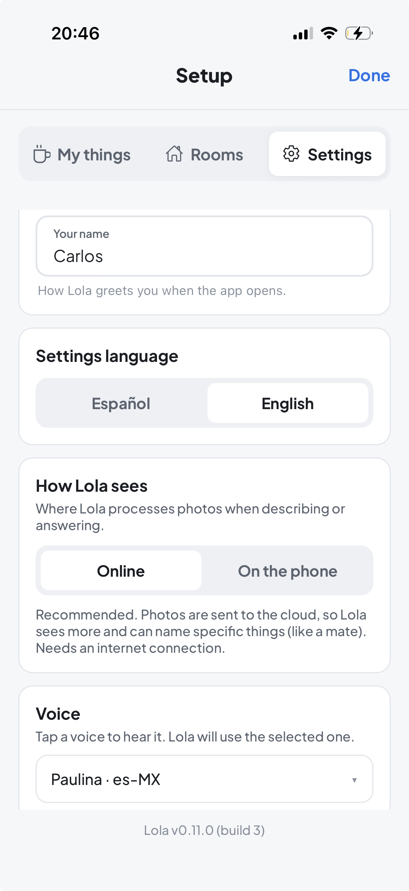

# Lola 👁️‍🗨️

> An assistive-vision app for a low-vision user — built for Charly's father. Lola
> describes what's in front of you, answers spoken questions about it, and guides
> you to everyday objects with haptic "warmer / colder" feedback. Spanish
> (Argentine *voseo*) throughout.

**Status:** active development · v0.11.0 · Android (priority) + iOS. Solo project.

The app lives in [`app/`](app/); design notes in [`docs/`](docs/); day-to-day
conventions (for contributors and AI sessions) in [`CLAUDE.md`](CLAUDE.md).

## Table of contents

- [What it does](#what-it-does)
- [Screenshots](#screenshots)
- [Tech stack](#tech-stack)
- [Project layout](#project-layout)
- [Getting started](#getting-started)
- [Build & run on a device](#build--run-on-a-device)
- [Versioning](#versioning)
- [Conventions](#conventions)
- [License](#license)

## What it does

- **Describir** — point the phone; Lola narrates the scene.
- **Preguntar** — ask a question out loud; Lola answers about what it sees.
- **Guíame a X** — say *"guiame a la taza"* and Lola homes you in, auto-picking the
  engine per object: a **generic** thing (a cup, the remote) runs the fast **on-device**
  detector with a Geiger-style vibration that quickens as you center it; one of **your
  own saved things** (*"guiame a mi mate"*) — or anything outside the common-object
  set — uses a **cloud** open-vocabulary model, showing the live camera through a
  peephole with spoken "where" cues (direction + a nearby landmark).
- **Setup** (caregiver) — register objects/rooms, tune the voice, pick the
  on-device **detection quality**.
- **Debug** (dev-only) — usage telemetry, a live detector spike, and model selection
  for testing embedded (on-device) vs online (cloud) vision/guide.

Designed for a blind / low-vision user: voice-first, large touch targets, audible
cues for every state, and nothing that fails silently.

## Screenshots

| | | |
|:---:|:---:|:---:|
|  |  |  |
| **Launch** — *"Hola, soy Lola"* | **Home** — two big actions: Describir / Preguntar | **Preguntar** — listening for your question |
|  |  |  |
| **Answer** — recognizes *your* saved object among look-alikes | **Setup — My things** — tag the objects you ask about | **Setup — Rooms** — map where you are |
|  |  |  |
| **Guíame a X** — peephole homing ("Buscando…") | **Found** — "¡Ahí está!" | **Setup — Settings** — language, AI mode, voice |

## Tech stack

- **Expo SDK 56**, **React Native 0.85**, New Architecture on, TypeScript.
- **Vision / language** — cloud **OpenRouter → Gemini 2.5 Flash**, plus an
  on-device path (VLM + small text LLM) via **react-native-executorch**, selectable
  per request through a routing seam (`src/services/ModelRouter.ts`).
- **Guide detector** — on-device **YOLO26** (COCO) over **VisionCamera v5** frame
  processors for generic objects (quality is a per-device level — model + input size,
  see `src/adapters/detectionPresets.ts`), plus **cloud open-vocabulary grounding**
  (OpenRouter) for saved/personal objects the on-device set can't cover.
- **Speech** — on-device TTS (`expo-speech`) and STT (`expo-speech-recognition`).

## Project layout

```
app/            the Expo app (package.json, source, native ios/ + android/)
  src/
    adapters/   device/SDK seams (camera, tts, stt, haptics, detectors, models)
    services/   orchestration (Ask/Describe/Guide, routing, settings, catalog)
    screens/    Home, Setup, Guide, Debug
  scripts/      sync-version.mjs — keeps the version unified across platforms
docs/design/    feature & decision notes
docs/runbooks/  dev build, sideload, TestFlight, EAS secrets
```

## Getting started

All commands run from `app/`:

```bash
npm install
npm start                 # Metro (JS hot-reload over a dev client)
npm test                  # jest
npm run lint              # eslint
npx tsc --noEmit          # types
```

The OpenRouter key for local dev goes in `app/.env.local`
(`EXPO_PUBLIC_OPENROUTER_API_KEY=...`); see [`app/.env.local.example`](app/.env.local.example).
It is git-ignored — **never commit it**.

> **Verify before claiming done:** `npx tsc --noEmit` · `npx jest` · `npx eslint src`
> — all fast, all expected to pass.

## Build & run on a device

The dev client and release builds are produced via **EAS** (this machine has no
local Android SDK/NDK):

```bash
cd app
npx eas-cli@latest build --profile development --platform android
npx expo start --dev-client
```

iOS is built locally from source (an RN 0.85 prebuilt-pod bug is worked around with
`ios.buildReactNativeFromSource`). The full iOS sideload / TestFlight walkthroughs
live in [`docs/runbooks/`](docs/runbooks/).

## Versioning

`app/app.json` (`version`, `ios.buildNumber`, `android.versionCode`) is the **single
source of truth**. After bumping it, run:

```bash
cd app && npm run sync-version
```

to stamp the **same** version into both `ios/Lola/Info.plist` and
`android/app/build.gradle`, so iOS and Android never drift.

## Conventions

- User-facing Spanish strings live in `src/services/CopyModule.ts` (voseo, enforced
  by lint); caregiver/Setup strings are bilingual in `src/i18n/setupStrings.ts`.
- `Result<T, E>` for fallible adapters; adapters in `src/adapters`, orchestration in
  `src/services`.
- iOS-only behavior is guarded with `Platform.OS === 'ios'` and called out — the
  Android Galaxy is the priority/floor device, so its behavior is never changed
  silently.

## License

Private project — all rights reserved. Not licensed for redistribution.

## Acknowledgments

Built with care for one user who matters. 💙
